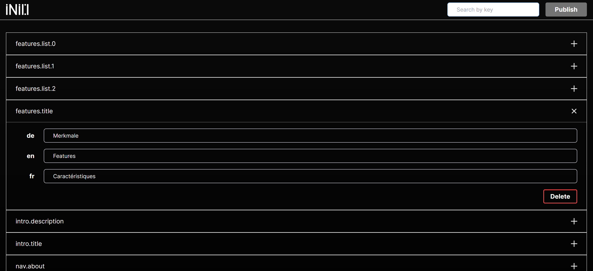

# @nimpl/inio

Utility for editing a group of JSON files

## Features

Creation - create a key that will be added to all files that match the pattern

Editing - correct the values of nested keys in each file

Deletion - delete the key from all files

## Installation

```bash
npm install @nimpl/inio -g
```

## Usage

```bash
inio './langs/<key>.json'
```

Where './langs/<key>.json' - is the pattern of files that you want to edit, with the following file structure:

```
root
--langs
----en.json
----de.json
----fr.json
```

The pattern should contain `<key>` - this is a dynamic parameter, equivalent to * in glob rules.

The utility will start a local server, through which all your file changes will subsequently occur.

Then open [inio.nimpl.tech](https://inio.nimpl.tech/) and edit the files through a comfortable interface.



## Additional

Please consider giving a star if you like it, it shows that the package is useful and helps continue work on this and other packages.

Create tasks with wishes, ideas, difficulties, etc. All of them will definitely be considered and thought over.

## License

[MIT](https://github.com/vordgi/nimpl-inio/blob/main/LICENSE)
